  

<h1 align="center"> 
  
</h1>

  
  &nbsp;
  
  &nbsp;
  

 

  
  <b>Large Language Models · ML Optimization · Computer Vision · AI for Healthcare · Adaptive Learning Systems</b>

 

> 💡 **About Me:** I am a Machine Learning Engineer and AI Researcher dedicated to building scalable AI inference pipelines, designing neural architectures, and contributing to impactful open-source tech.

---

<h2 align="center">
   
  Tech Stack & Skills
</h2>

  

  <i>Transformers | LLMs | Prompt Engineering | OpenCV | MediaPipe | NLTK | ETL Pipelines</i>

---

<h2 align="center">
   
  Experience
</h2>

  

---

<h2 align="center">
   
  Featured Projects
</h2>

  

---

<h2 align="center">
   
  Publications & Certifications
</h2>

| 📚 Title | 📖 Venue | 🔗 DOI |
| :--- | :--- | :---: |
| **FAANG Stock Forecasting via Feature Engineering & LSTM** | *IEEE AIDE 2025* | [10.1109/AIDE64228.2025.10987293](https://doi.org/10.1109/AIDE64228.2025.10987293) |
| **Fare Prediction in Ride-Hailing via Neural Networks** | *IEEE AIDE 2025* | [10.1109/AIDE64228.2025.10987321](https://doi.org/10.1109/AIDE64228.2025.10987321) |
| **Prediction of Ka-Band TWTA via FNN** | *ICKECS 2025* | [10.1109/ICKECS65700.2025.11034912](https://doi.org/10.1109/ICKECS65700.2025.11034912) |
| **Precision Agriculture: Soil Fertility System** | *E3S Web of Conference* | [10.1051/e3sconf/202669203002](https://doi.org/10.1051/e3sconf/202669203002) |
| **Predicting Enzyme Property Alterations** | *IEEE MPCON 2025* | [10.1109/MPCON66082.2025.11251497](https://doi.org/10.1109/MPCON66082.2025.11251497) |

---

<h2 align="center">
   
  Honors & Awards
</h2>

> 🌟 **GSoC 2025 Contributor** – Selected among top 1.2% applicants worldwide.  
> 🎙️ **LinkedIn 2× Top Voice** in GIS / Machine Learning (2024).  
> 🥇 **Global Rank 1 in Python Programming** – HackerRank (2023).  
> 🏅 **Excellence in Machine Learning Award** – Aqmenz Automation Pvt Ltd (2024).  
> ⭐ **NCC Senior Under Officer** – Rank 1, Karnataka & Goa Directorate (2500+ cadets).  
> 🎖️ **NCC Gold Medal** – Ek Bharat Shreshtha Bharat (EBSB); Certificates A, B, C.

---

<h2 align="center">
   
  GitHub Activity & Impact Dashboard
</h2>

<table align="center" width="100%">
  <tr>
    <td width="50%" align="center">
      <h3>🔥 GitHub Streak</h3>
      
    </td>
    <td width="50%" align="center">
      <h3>🏆 Open Source Impact</h3>
      
    </td>
  </tr>
  <tr>
    <td width="50%" align="center">
      <h3>💻 Top Languages</h3>
      
    </td>
    <td width="50%" align="center">
      <h3>💻 Key Competencies</h3>
      
    </td>
  </tr>
</table>

 

  <h3>🐍 GitHub Contributions Snake</h3>
  <picture>
    <source media="(prefers-color-scheme: dark)" srcset="https://raw.githubusercontent.com/PRIYANSHU2026/PRIYANSHU2026/output/github-contribution-grid-snake-dark.svg">
    <source media="(prefers-color-scheme: light)" srcset="https://raw.githubusercontent.com/PRIYANSHU2026/PRIYANSHU2026/output/github-contribution-grid-snake.svg">
    
  </picture>
   
  <i>(Note: Push this README to GitHub to trigger the Snake Action and render the animation!)</i>

